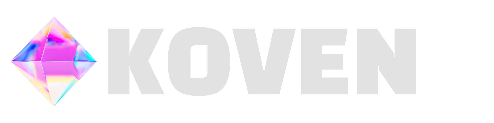

<p align="center">
  
</p>

<p align="center">
  <a href="https://koven.chat">koven.chat</a>
  &nbsp;·&nbsp;
  <a href="https://client.koven.chat">client.koven.chat</a>
  &nbsp;·&nbsp;
  <a href="https://gnosyslabs.xyz">GnosysLabs</a>
</p>

<p align="center">
  <strong>The first public-square chat platform where censorship requires consensus, not authority.</strong>
</p>

---

## What Koven is

Group chat — spaces, rooms, DMs, voice + video calls, screen share, bots — built on Matrix + a governance layer that makes "kick this person" or "delete that message" a community decision, not a moderator's whim. Discord shape, with one rule that's actually enforced by the protocol: no individual silences another for ordinary speech.

### Features

- **Spaces and rooms** — Discord-style. A space is a server; rooms are channels inside. Joining a space cascade-joins you into its rooms automatically.
- **Direct messages** — end-to-end encrypted by default (Matrix Megolm). 1:1 only.
- **Live channels (voice + video + screen-share)** — every room can host group calls. DM calls ring once and connect. Powered by Cloudflare RealtimeKit (the SFU); see the setup notes below.
- **Encrypted spaces** — private spaces can opt into "every room E2EE forever" at creation. Permanent, trades moderation for privacy. Use for trusted-group / family / small-team installs.
- **Multi-user bot platform** — anyone with an account can create LLM bots. OpenRouter or any OpenAI-compatible endpoint. MCP servers (stdio sandboxed via bwrap, or HTTP). Inbound + outbound webhooks. You pay for tokens; the platform runs the orchestration.
- **Consensus moderation** — flagging requires multiple distinct people AND a weighted-score gate that scales with the room's activity. Reputation accumulates with participation and decays with silence. Floor violations (CSAM / credible threats / doxxing) bypass the vote and go to admin review.
- **Public mod log** — every flag, collapse, suspension is logged forever, append-only, readable by anyone in the room. The only check on collective moderation power is sunlight.
- **Universal deep links** — `koven://` scheme + `https://client.koven.chat/invite/…` Universal Links open the desktop app directly on macOS, Linux, and Windows. Confirmation card with preview metadata before the user joins.
- **Inline room mentions** — paste a room id, alias, invite URL, or matrix.to link in any message and it renders as a Discord-style pill. Click jumps in.
- **Per-instance, no federation** — Koven instances don't federate with each other or with vanilla Matrix homeservers. Each Koven instance is its own community with its own moderation outcomes, its own reputation registry, its own mod log. See [`docs/GOVERNANCE.md`](docs/GOVERNANCE.md#why-koven-doesnt-federate) for the reasoning.

See [docs/GOVERNANCE.md](docs/GOVERNANCE.md) for the moderation primitives in detail. Two end-user-facing guides also live in `docs/`: [koven-user-guide.md](docs/koven-user-guide.md) (everything members see in the product) and [koven-bot-guide.md](docs/koven-bot-guide.md) (the bot platform end-to-end, including MCP + webhooks).

---

## What's in this repo

The web client, the desktop app (Tauri), the server-side governance engine, and a complete self-hosting bundle (Synapse — client-server API only, no federation — Postgres, coturn, plus a choice of Caddy with auto-TLS or host nginx + certbot).

```
                    ┌────────────────────┐
                    │  Caddy (or nginx)  │   TLS + reverse proxy + static SPA host
                    └─────────┬──────────┘
                              │
       ┌──────────────────────┼─────────────────────────────┐
       ▼                      ▼                             ▼
   ┌───────┐              ┌────────┐                  ┌─────────┐
   │  SPA  │              │ engine │                  │ synapse │
   └───┬───┘              └────┬───┘                  └────┬────┘
       │                       │                           │
       │ (calls SDK)           │ (custom events,           ▼
       ▼                       │  appservice)         ┌─────────┐
  ┌──────────────┐             │                     │postgres │
  │  Cloudflare  │◄────────────┘                     └─────────┘
  │  RealtimeKit │   webhook                              ▲
  │     SFU      │   (call presence)                      │
  └──────────────┘                                ┌──────────────┐
                                                  │    coturn    │   STUN/TURN
                                                  └──────────────┘   for legacy
                                                                     Matrix VoIP
```

| Path                   | Role                                                                                                  |
|------------------------|-------------------------------------------------------------------------------------------------------|
| `client/`              | Vite + React + Tailwind web client (the SPA)                                                          |
| `apps/desktop/`        | Tauri 2 desktop bundle (macOS / Linux / Windows)                                                      |
| `engine/`              | Bun service: governance, admin, profiles, bots, calls, instance config                                |
| `shared/`              | TypeScript types shared between client and engine                                                     |
| `docker/synapse/`      | Synapse Dockerfile + config templates + `koven-room-gate` Synapse module                              |
| `docker/coturn/`       | coturn config template                                                                                |
| `docker/nginx/`        | Optional nginx config template if you're not using the bundled Caddy                                  |
| `marketing/`           | Static landing site at <https://koven.chat>                                                           |
| `tools/seed.ts`        | Idempotent seed script. Populates a fresh install with users, spaces, rooms, and chat for development |
| `bin/koven`            | Install / setup script                                                                                |
| `bin/deploy-marketing` | rsync the marketing site to the koven.chat VPS                                                        |

---

## Self-hosting your own instance

Designed for a Linux VPS with Docker + a hostname pointed at it. The full stack — Synapse, Postgres, coturn, the Koven engine, the web client, Caddy fronting it all with auto-renewing Let's Encrypt certs — comes up in three commands once your `.env` is set.

### Prerequisites

- A VPS (anything from a $5 droplet up; 2 GB RAM is comfortable, 1 GB works for small instances).
- **Docker** with Docker Compose v2.
- **`bun` ≥ 1.1** on the host (used to build the web client during setup).
- A domain name + DNS A record(s) pointing at the server's public IP.
- Ports **80**, **443**, and **3478** (UDP+TCP) reachable from the internet.

Optional but recommended:
- A **Cloudflare account** if you want voice / video / screen-share — see below.
- An **SMTP provider** (or Resend) for the passwordless-sign-in emails. The engine works without one in dev but production sign-in needs a working `MAIL_FROM` + provider creds.

### 1. Clone + configure

```sh
git clone https://github.com/GnosysLabs/koven-chat
cd koven-chat
cp .env.example .env
$EDITOR .env
```

You'll edit three sections:

#### a) Domain & TLS

There are three valid layouts. Pick the one that matches your DNS situation:

| Layout                       | `.env` values                                                                                  | DNS |
|------------------------------|------------------------------------------------------------------------------------------------|-----|
| **Apex-only** — chat lives at `koven.example` | `KOVEN_HOSTNAME=koven.example`<br>`SERVER_NAME=koven.example`<br>`ADMIN_EMAIL=you@…`            | `koven.example  A  <vps-ip>` |
| **Apex + subdomain** — app at `client.koven.example`, user IDs `@alice:koven.example` | `KOVEN_HOSTNAME=client.koven.example`<br>`SERVER_NAME=koven.example`<br>`ADMIN_EMAIL=you@…`     | Both `koven.example  A  <vps-ip>` AND `client.koven.example  A  <vps-ip>` |
| **Subdomain-only** — no apex control, user IDs `@alice:client.koven.example` | `KOVEN_HOSTNAME=client.koven.example`<br>`SERVER_NAME=client.koven.example`<br>`ADMIN_EMAIL=you@…` | `client.koven.example  A  <vps-ip>` |

`KOVEN_HOSTNAME` is where the SPA + Synapse actually live. `SERVER_NAME` is what appears after the colon in user IDs. They can be the same (layout 1 + 3) or different (layout 2 — apex serves only `/.well-known/*` plus a redirect).

#### b) Email (passwordless sign-in)

Koven sign-in is passwordless — users get a 6-digit code emailed to them on demand. Configure your provider in `.env`:

```sh
MAIL_PROVIDER=resend           # or "smtp"
MAIL_FROM=hello@koven.example
RESEND_API_KEY=...             # if MAIL_PROVIDER=resend
# or
SMTP_HOST=smtp.fastmail.com    # if MAIL_PROVIDER=smtp
SMTP_PORT=465
SMTP_USER=...
SMTP_PASSWORD=...
```

Without email configured, the engine logs the code to stdout — fine for dev, useless for production.

#### c) Cloudflare RealtimeKit (voice/video/screen-share)

Koven's Live channels (group calls in rooms + DM calls) run on **Cloudflare RealtimeKit** as the selective forwarding unit. Without these credentials the Join Live button is hidden and `/api/calls/*` returns 503 — text + everything else still works, just no calls.

```sh
CF_REALTIME_ACCOUNT_ID=...      # right sidebar of any Cloudflare account page
CF_REALTIME_APP_ID=...          # Realtime → RealtimeKit → New App
CF_REALTIME_TOKEN=...           # Profile → API Tokens → permission "Realtime: Edit"
CF_REALTIME_WEBHOOK_SECRET=...  # openssl rand -hex 32
PUBLIC_ENGINE_URL=https://client.koven.example   # your public hostname
```

Get the first three from the Cloudflare dashboard (free tier works for small instances; check Cloudflare's RealtimeKit pricing for production). The webhook secret is just a long random string the engine uses to authenticate inbound presence webhooks from Cloudflare — generate it yourself.

If you don't want calls at all, leave these blank. Everything else still works.

### 2. Run setup

```sh
./bin/koven setup
```

This:

1. Generates random secrets (Postgres password, Synapse macaroon/form/registration secrets, engine appservice tokens, TURN shared secret, bot-key encryption secret) and writes them back into `.env`. **Idempotent** — existing values are preserved on re-runs.
2. On first run, generates Synapse's signing key (`synapse-data/signing.key`). Synapse needs this to sign its own events; if you lose it Synapse won't boot.
3. Renders Synapse's `homeserver.yaml`, the engine appservice registration, the coturn config, and (if applicable) the nginx config from templates in `docker/`. Re-run after editing `.env` to propagate changes.
4. Builds the web client (`bun install && bun run --cwd client build`). Caddy serves the output from `client/dist`.
5. Renders the Caddyfile (or nginx config, depending on your choice) for your domain layout.

### 3. Bring it up

```sh
docker compose up -d
```

Caddy fetches Let's Encrypt certs for whichever hostname(s) you set. Synapse boots, the engine connects to Synapse as an appservice and registers its Cloudflare webhook. Postgres + coturn start in the background.

Open `https://<your hostname>` and sign up. **The first user to register becomes the instance admin** — no special bootstrap step; the engine promotes you on first authenticated request.

### Verifying it works

- Web client loads at `https://<hostname>`.
- You can register a second account and DM yourself; messages are E2EE.
- Live channel button shows in any room (only if Cloudflare credentials are set).
- `https://<hostname>/.well-known/matrix/client` returns JSON pointing at your Synapse.  (No `/.well-known/matrix/server` or `/.well-known/koven` — Koven instances don't federate; only the client-discovery route is served.)

If any of those fail, `docker compose logs caddy synapse engine` shows what's wrong. The most common gotcha is DNS not propagated yet (Let's Encrypt cert acquisition fails → Caddy keeps retrying every 15 min).

---

## Optional: nginx instead of Caddy

If your host already runs nginx + certbot for other services on the same VPS, you can skip the bundled Caddy.

**Activate the override** in `.env`:

```sh
COMPOSE_FILE=docker-compose.yml:docker-compose.nginx.yml
```

(or pass `-f docker-compose.yml -f docker-compose.nginx.yml` to every `docker compose` invocation if you'd rather not set it persistently). The override skips the Caddy service and binds Synapse + the engine to `127.0.0.1` so only the host nginx can reach them.

**Render the nginx config**:

```sh
./bin/koven setup
```

This produces `docker/nginx/koven.conf` from the template, with your `KOVEN_HOSTNAME`, `SERVER_NAME`, and `ADMIN_EMAIL` filled in.

**Install it** into nginx and ask certbot for certs:

```sh
sudo cp docker/nginx/koven.conf /etc/nginx/sites-available/koven
sudo ln -s /etc/nginx/sites-available/koven /etc/nginx/sites-enabled/koven
sudo nginx -t && sudo systemctl reload nginx
sudo certbot --nginx -d $KOVEN_HOSTNAME -d $SERVER_NAME \
  --redirect --agree-tos --email $ADMIN_EMAIL --non-interactive
```

(Drop the second `-d` flag for the subdomain-only layout — there's no apex hostname to certify.)

certbot rewrites `/etc/nginx/sites-available/koven` in place to add TLS listen lines and cert paths. Subsequent `./bin/koven setup` re-runs only re-render `docker/nginx/koven.conf` — they don't touch the live `/etc/nginx/sites-available/koven`, so certbot's edits stick. If you change `.env` and want the live config updated, re-cp + re-run certbot (idempotent).

Bring the stack up the same way:

```sh
docker compose up -d
```

---

## No federation

Koven instances **do not federate** — with each other or with any other Matrix server. Each instance is its own bounded community: its own membership, its own reputation registry, its own consensus moderation outcomes, its own mod log. Cross-instance DMs, cross-instance rooms, cross-instance reputation — none of it exists. A user on one Koven instance can't reach a user on another except by joining that other instance directly.

The reasoning is laid out in full in [`docs/GOVERNANCE.md`](docs/GOVERNANCE.md#why-koven-doesnt-federate). The short version: Koven's value proposition is consensus-driven moderation backed by a shared reputation registry. Federation makes the community boundary fuzzy, makes remote reputation un-trustable, and makes moderation outcomes diverge per-server — all three are load-bearing, and federation actively undermines them.

Concretely: Synapse runs with `federation_domain_whitelist: []` and no `federation` listener, the reverse proxy serves no `/.well-known/matrix/server` route, and nothing in the codebase branches on "is this a remote room."

---

## Updating

```sh
git pull
./bin/koven setup            # re-render configs, rebuild the SPA
docker compose build         # rebuild engine + Synapse images if changed
docker compose up -d
```

For SPA-only updates (no engine code change), `bun run --cwd client build` is enough — Caddy/nginx serves the new `client/dist` immediately, no container restart.

---

## Desktop apps

Koven Desktop is a Tauri 2 bundle (WKWebView on macOS, WebView2 on Windows, WebKitGTK on Linux) that wraps the same SPA. Adds:

- Native window chrome + traffic-light controls.
- OS-level deep links (`koven://` scheme + Apple Universal Links for `https://client.koven.chat/invite/…`).
- Signed auto-updater pulling from GitHub Releases.
- Native save-as dialog for file downloads.
- Native toast notifications via Notification Center / Action Center / libnotify.

Releases live at [github.com/GnosysLabs/koven-chat/releases](https://github.com/GnosysLabs/koven-chat/releases). The macOS arm64 build is the only one we ship signed + notarized today; Linux + Windows builds also publish but you'll see Gatekeeper / SmartScreen warnings on first launch.

Build locally (requires Rust + the platform-specific Tauri prereqs):

```sh
cd apps/desktop
bun install
bun run tauri build
```

---

## Bots

Anyone with an account can create LLM bots from Settings → Bots → New. Default cap is 30 bots per user (`MAX_BOTS_PER_USER` env var on the engine to raise/lower).

A bot is a Matrix user the engine drives on your behalf using an LLM API key you supply. Triggers on `@-mention` in a group room, or any message in a 1:1 DM with it. Configurable per-bot:

- **Identity** — display name, avatar, bio, "accept DMs from non-owners" gate.
- **Connection** — OpenRouter or any OpenAI-compatible endpoint (API base, key, model). Keys are encrypted at rest with `BOT_KEY_ENCRYPTION_SECRET`.
- **Behavior** — system prompt, context window (1–100 recent messages included per call).
- **Knowledge** — RAG uploads (PDFs, text, markdown). Retrieved per call.
- **MCP tools** — HTTP MCPs (URL + headers) or stdio MCPs (subprocess, sandboxed via bwrap, env stripped, npm versions auto-pinned).
- **Webhooks** — LLM-callable outbound HTTP tools (with `{placeholder}` URL templates) + inbound webhook endpoints (auto-detected GitHub / Twilio / generic JSON, optional HMAC signing).
- **Limits** — per-reply token cap, daily token cap, daily call cap.

Bot governance: the no-individual-silencing rule applies to humans, not bots. Owners can delete their bot's messages; a room's founder can kick or ban a bot from their room without consensus. Logged in the public mod log.

Detailed guide: see `apps/desktop/koven-bot-guide.md` (the version on the developer's desktop) or read `engine/src/bot_pipeline.ts`.

---

## Dev

Local development without the full Docker stack:

```sh
# Synapse + Postgres still need to be running.  Spin them up via Docker:
docker compose up -d synapse postgres

# In separate terminals:
bun install
bun run dev:engine    # engine on :9000
bun run dev           # vite dev server on https://localhost:1420 (self-signed cert)
```

Vite uses port **1420** (matches Tauri's convention so `tauri.conf.json`'s `devUrl` stays valid). The dev server uses a self-signed TLS cert because the matrix-rust-sdk WASM crypto module needs a secure context — you'll get a browser warning the first time, accept it once and forget.

For a "fresh install from scratch" E2E test, use the full `./bin/koven setup` + `docker compose up -d` path documented above.

### Seeding test data

The `tools/seed.ts` script populates a fresh dev install with synthetic users, spaces, rooms, and chat history so the empty-state isn't blocking:

```sh
bun run tools/seed.ts
```

Idempotent — re-run anytime to top up. Drop the DB to start clean.

---

## Architecture

- **Wire protocol**: [Matrix](https://matrix.org/). Federation, file sharing, profiles, E2EE all come from the spec. Koven doesn't reinvent the transport.
- **Governance layer**: Koven-native. Consensus moderation primitive, public audit log, weighted reputation engine, automatic decay, floor-violation review. Built on top of Matrix events as custom event types (`chat.koven.flag.v1`, `chat.koven.collapse.v1`, `chat.koven.space.config`, …).
- **Calls**: Cloudflare RealtimeKit as the SFU. The engine mints per-call participant tokens via Cloudflare's API; the client SDK connects directly to Cloudflare's edge. Synapse + coturn handle Matrix-spec 1:1 VoIP for legacy clients only — Koven Desktop / the SPA use RealtimeKit exclusively.
- **Bots**: matrix-rust-sdk WASM running inside the engine's bun process, one client per bot. OpenAI-shape tool definitions cover both outbound webhooks and MCP attachments; the engine bridges between the two.
- **Encryption**: DMs are end-to-end encrypted (Megolm) by default. Spaces can be created with the `e2ee_required` policy — every child room inherits encryption automatically, permanently. Encrypted rooms bypass the consensus layer because the engine bot can't observe their content; the SPA hides flag affordances in encrypted rooms and labels them with a `Lock` badge in the chat header.
- **Federation gate**: a custom Synapse spam-checker module rejects events from non-Koven peers. Symmetric: every Koven instance auto-serves `/.well-known/koven` so discovery is two-way.

See `engine/src/` for the governance primitives in detail. The interesting files:

- `engine/src/weight.ts` — reputation math.
- `engine/src/aggregate.ts` — event-stream → DB state machine.
- `engine/src/server.ts` — the engine's HTTP API + appservice transaction handler.
- `engine/src/bot_pipeline.ts` — bot trigger detection, context gathering, tool-call loop.
- `engine/src/calls.ts` — Cloudflare RealtimeKit token minting.

---

## License

MIT. See [`LICENSE`](./LICENSE).
